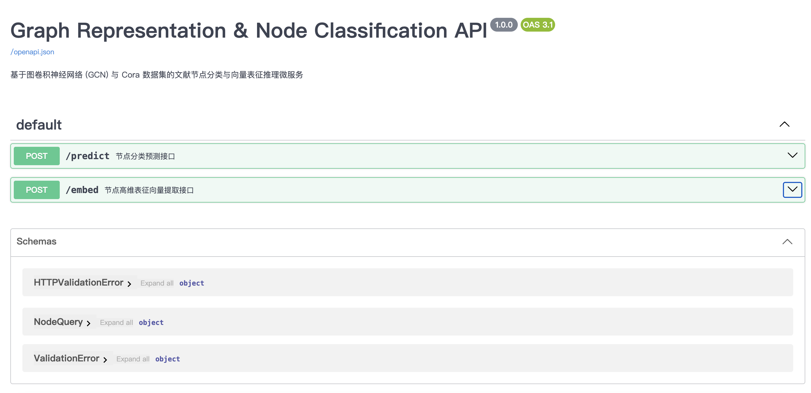

# 🧠 基于 GCN 图神经网络与 FastAPI 的节点分类微服务

[](https://www.python.org/)
[](https://fastapi.tiangolo.com/)
[](https://pytorch.org/)

本项目基于 **PyTorch Geometric (PyG)** 构建了两层图卷积神经网络 (GCN)，在经典的学术论文引用网络 **Cora 数据集** 上实现了节点特征提取与分类推理，并结合 **FastAPI** 封装为高性能、易扩展的异步 RESTful API 微服务。

---

## 📸 交互式接口文档 (Swagger UI)

服务内置 OpenAPI 规范交互文档，支持在网页端直接进行参数校验与前向推理测试：



---

## 🌟 核心特性与架构

- 📐 **图深度学习建模**：使用 `GCNConv` 算子构建双层图拓扑特征抽取网络，处理非欧几里得结构数据。
- 📊 **Cora 引用网络**：包含 2708 个学术文献节点、1433 维词袋向量特征及 7 类分类目标。
- ⚡ **异步微服务化**：基于 ASGI 标准框架 FastAPI，具备自动请求体校验 (Pydantic DTO) 与高并发低延迟响应能力。
- 🔍 **双通道接口设计**：
  - `POST /predict`：输入节点编号，实时推理并输出预测文献所属类别。
  - `POST /embed`：提取节点在潜空间的 512 维高维表征嵌入向量 (Node Embeddings)。

---

## 🛠 本地快速运行指南

### 1. 安装依赖环境
```bash
pip install fastapi uvicorn torch torchvision torchaudio
pip install torch_geometric
```

### 2. 启动推理微服务
```bash
uvicorn main:app --reload
```

### 3. 访问交互文档
在浏览器打开以下地址即可进行可视化接口调用：
👉 `http://127.0.0.1:8000/docs`
